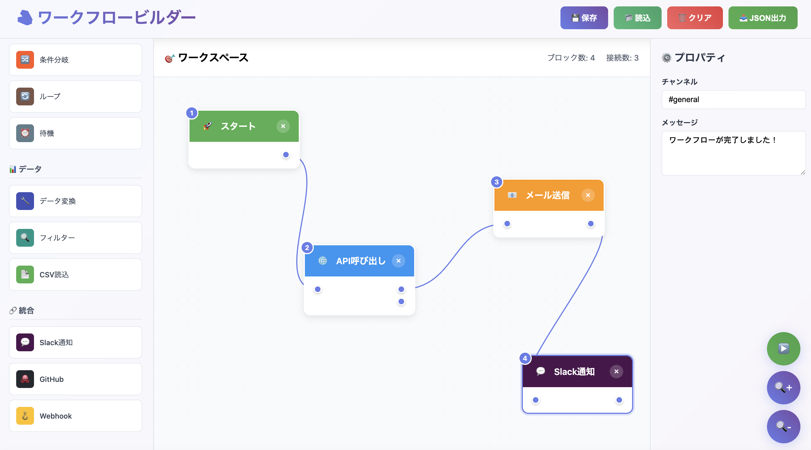

# 🧱 ワークフロービルダー



視覚的にワークフローを構築できるドラッグ&ドロップ式のブロックエディタです。

**🚀 [Demo URL](https://masvc.github.io/nocode-block-workflow-test/)**

## ✨ 機能

- 🎨 **ドラッグ&ドロップ** でブロックを配置
- 🔗 **クリック接続** でブロック間を接続
- 📊 **実行順序** を自動表示
- ⚙️ **プロパティ編集** で詳細設定
- 💾 **保存・読込** でワークフロー管理
- 📤 **JSON 出力** でデータエクスポート

## 🎯 使い方

1. **ブロック配置**: 左パレットからドラッグ&ドロップ
2. **接続**: 出力 ○ → 入力 ○ をクリック
3. **設定**: ブロック選択して右パネルで編集
4. **実行**: ▶️ ボタンで動作確認

## 🔧 技術

- Vanilla JavaScript
- HTML5 + CSS3
- localStorage 対応
- レスポンシブデザイン

## 📁 ファイル

```
├── index.html    # メインファイル
├── style.css     # スタイル
├── script.js     # ロジック
└── README.md     # ドキュメント
```

## 🚀 デプロイ

GitHub Pages で簡単デプロイ：

1. リポジトリ作成
2. ファイルアップロード
3. Settings > Pages > Source: main branch
4. 完了！

---

MIT License | [GitHub](https://github.com/masvc/nocode-block-workflow-test)
